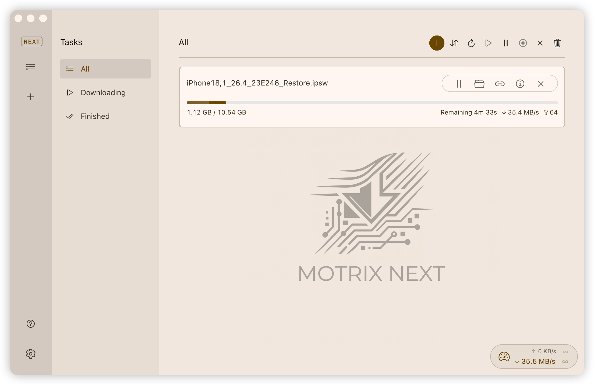
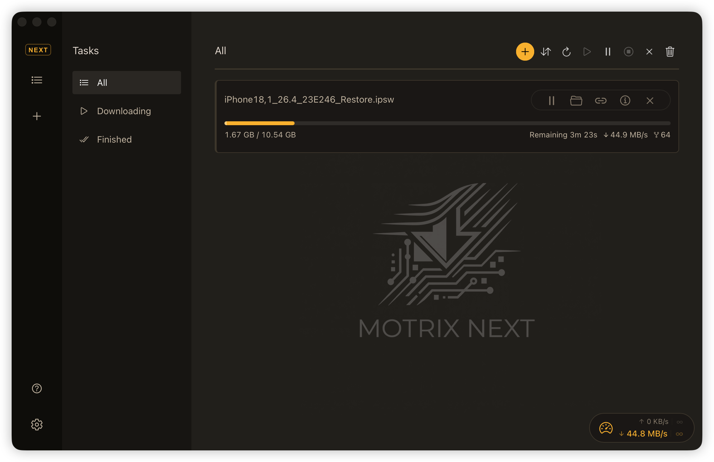

<div align="center">
  
  <h1>Motrix Next</h1>
  <p>A full-featured download manager — rebuilt from the ground up.</p>

  [](https://github.com/AnInsomniacy/motrix-next/releases)
  
  
  <br>
  
  

  [](https://motrix-next.pages.dev)
  [](https://github.com/AnInsomniacy/motrix-next-extension)
</div>

---

<div align="center">
  <table><tr>
    <td></td>
    <td></td>
  </tr><tr>
    <td align="center"><sub>Light Mode</sub></td>
    <td align="center"><sub>Dark Mode</sub></td>
  </tr></table>
</div>

## Why Motrix Next?

[Motrix](https://github.com/agalwood/Motrix) by [agalwood](https://github.com/agalwood) was one of the best open-source download managers available — clean UI, aria2-powered, cross-platform. It inspired thousands of users and developers alike.

However, the original project has been largely inactive since 2023. The Electron + Vue 2 + Vuex + Element UI stack accumulated technical debt, making it increasingly difficult to maintain, extend, or package for modern platforms.

### What we rebuilt

Motrix Next is a ground-up rewrite — same download manager spirit, entirely new codebase.

| Layer | Motrix (Legacy) | Motrix Next |
|-------|----------------|-------------|
| **Runtime** | Electron | **Tauri 2** (Rust) |
| **Frontend** | Vue 2 + Vuex | **Vue 3 Composition API + Pinia** |
| **UI Framework** | Element UI | **Naive UI** |
| **Language** | JavaScript | **TypeScript + Rust** |
| **Styling** | SCSS + Element theme | **Vanilla CSS + custom properties** |
| **Engine Mgmt** | Node.js `child_process` | **Tauri sidecar** |
| **Build System** | electron-builder | **Vite + Cargo** |
| **Bundle Size** | ~80 MB | **~20 MB** |
| **Auto-Update** | electron-updater | **Tauri updater plugin** |

> [!NOTE]
> **6-platform aria2 engine** — the [official aria2 release](https://github.com/aria2/aria2/releases) only ships Windows 32/64-bit and Android ARM64 pre-built binaries. We [compile aria2 from source](https://github.com/AnInsomniacy/aria2-builder) as fully static binaries for all 6 targets: macOS (Apple Silicon / Intel), Windows (x64 / ARM64), and Linux (x64 / ARM64).


### Design & Motion

The overall UI layout stays true to Motrix's original design — the sidebar navigation, task list, and preference panels all follow the familiar structure that made Motrix intuitive from day one.

What changed is everything underneath. Every transition and micro-interaction has been carefully tuned to follow [Material Design 3](https://m3.material.io/styles/motion/overview) motion guidelines:

- **Asymmetric timing** — enter animations are slightly longer than exits, giving new content time to land while dismissed content leaves quickly
- **Emphasized easing curves** — decelerate on enter (`cubic-bezier(0.2, 0, 0, 1)`), accelerate on exit (`cubic-bezier(0.3, 0, 0.8, 0.15)`), replacing generic `ease` curves throughout the codebase
- **Spring-based modals** — dialogs use physically-modeled spring animations for a natural, responsive feel
- **Consistent motion tokens** — all durations and curves are defined as CSS custom properties, ensuring a unified rhythm across 12+ components

## Features

- **Multi-protocol downloads** — HTTP, FTP, BitTorrent, Magnet links
- **BitTorrent** — Selective file download, DHT, peer exchange, encryption, GeoIP peer flags
- **Tracker management** — Auto-sync from community tracker lists with protocol probing
- **Concurrent downloads** — Configurable parallel tasks and per-task thread count
- **Speed control** — Global and per-task upload/download limits with time-of-day scheduling
- **System tray** — Real-time speed display in the menu bar (macOS), background operation
- **Color schemes** — Multiple built-in color themes with light/dark mode and system preference detection
- **Lightweight mode** — Destroys the frontend window on close/minimize, keeping only the tray and engine alive
- **File categorization** — Auto-sort completed downloads into subdirectories by file type
- **UPnP port mapping** — Automatic NAT traversal for better BitTorrent connectivity
- **Keep awake** — Prevent system sleep while downloads are active
- **Clipboard detection** — Monitor clipboard for downloadable URLs with per-protocol filters
- **Auto-archive** — Automatically archive completed tasks to keep the task list clean
- **Shutdown when complete** — Optionally shut down the system after all downloads finish
- **i18n** — 26 languages, auto-detects system language on first launch
- **Task management** — Pause, resume, delete with file cleanup, batch operations
- **Download protocols** — Register as default handler for magnet and thunder links
- **Notifications** — System notifications on task completion
- **Lightweight** — Tauri-powered, ~20 MB bundle, minimal resource footprint
- **[Browser extension](https://github.com/AnInsomniacy/motrix-next-extension)** — Intercept downloads from Chrome / Edge with smart filtering, cookie forwarding, and real-time control ([Chrome Web Store](https://chromewebstore.google.com/detail/ofeajdebdjajhkmcmamagokecnbephhl) · [Edge Add-ons](https://microsoftedge.microsoft.com/addons/detail/loojjolhejmakcdlbidigoniobfanjlb))

## Installation

Download the latest release from [GitHub Releases](https://github.com/AnInsomniacy/motrix-next/releases).

### macOS

**Homebrew (recommended):**

```bash
brew tap AnInsomniacy/motrix-next
brew install --cask motrix-next
xattr -cr /Applications/MotrixNext.app  # remove quarantine (app is unsigned)
```

Or download `MotrixNext_aarch64.app.tar.gz` (Apple Silicon) / `MotrixNext_x64.app.tar.gz` (Intel) from [Releases](https://github.com/AnInsomniacy/motrix-next/releases) and drag to `/Applications`.

> [!TIP]
> If macOS says the app is **"damaged and can't be opened"**, see the [FAQ below](#faq).

### Windows

Download the installer from [Releases](https://github.com/AnInsomniacy/motrix-next/releases):

| Architecture | File |
|-------------|------|
| x64 (most PCs) | `MotrixNext_x.x.x_x64-setup.exe` |
| ARM64 | `MotrixNext_x.x.x_arm64-setup.exe` |

Run the installer — it takes about 10 seconds, no reboot required.

### Linux

Download from [Releases](https://github.com/AnInsomniacy/motrix-next/releases):

**Debian / Ubuntu:**

```bash
sudo dpkg -i MotrixNext_x.x.x_amd64.deb
```

**Fedora / RHEL:**

```bash
sudo rpm -i MotrixNext-x.x.x-1.x86_64.rpm
```

**Other distributions** — use the `.AppImage`:

```bash
chmod +x MotrixNext_x.x.x_amd64.AppImage
./MotrixNext_x.x.x_amd64.AppImage
```

All formats are available for both x64 and ARM64.

## FAQ

<details>
<summary><strong>macOS says the app is "damaged and can't be opened"</strong></summary>

<br>

This app is not code-signed. Open Terminal and run:

```bash
xattr -cr /Applications/MotrixNext.app
```

This removes the quarantine flag that macOS Gatekeeper applies to unsigned apps. If you installed via Homebrew with `--no-quarantine`, you won't hit this issue.

</details>

<details>
<summary><strong>Why is there no portable version?</strong></summary>

<br>

Motrix Next relies on [aria2](https://aria2.github.io/) as a sidecar process — a separate executable that Tauri launches at runtime. The aria2 binaries are [compiled from source](https://github.com/AnInsomniacy/aria2-builder) as fully static builds covering all 6 supported platforms. This architecture means:

- The **aria2 binary must exist alongside the main executable** — it cannot be embedded into a single `.exe`.
- **Deep links** (`magnet://`, `thunder://`) and **file associations** (`.torrent`) require Windows registry entries that only an installer can configure.
- The **auto-updater** needs a known installation path to replace files in place.

These are fundamental constraints of the Tauri sidecar model and the Windows operating system, not limitations we can work around. Notable Tauri projects like [Clash Verge Rev](https://github.com/clash-verge-rev/clash-verge-rev) (80k+ stars) previously shipped portable builds but [discontinued them](https://clash-verge.com/) due to the same set of issues.

We provide **NSIS installers** for Windows — lightweight (~20 MB), fast to install, and fully featured.

</details>

## Code Signing

Motrix Next is **not code-signed** on macOS or Windows, so your browser or antivirus software may show a security warning when downloading or running the installer.

The app is fully open-source and every release binary is built automatically by [GitHub Actions CI](https://github.com/AnInsomniacy/motrix-next/actions). For added peace of mind, you can always [build from source](#development).

> [!NOTE]
> See our [Code Signing Policy](docs/CODE_SIGNING.md) and [Privacy Policy](docs/PRIVACY.md).

## Development

### Prerequisites

- [Rust](https://rustup.rs/) (latest stable)
- [Node.js](https://nodejs.org/) >= 22
- [pnpm](https://pnpm.io/)

### Setup

```bash
# Clone the repository
git clone https://github.com/AnInsomniacy/motrix-next.git
cd motrix-next

# Install frontend dependencies
pnpm install

# Start development server (launches Tauri + Vite)
pnpm tauri dev

# Build for production
pnpm tauri build
```

### Project Structure

```
motrix-next/
├── src/                        # Frontend (Vue 3 + TypeScript)
│   ├── api/                    # Aria2 JSON-RPC client
│   ├── components/             # Vue components
│   │   ├── about/              #   About panel
│   │   ├── layout/             #   Sidebar, speedometer, navigation
│   │   ├── preference/         #   Settings pages, update dialog
│   │   └── task/               #   Task list, detail, add task
│   ├── composables/            # Reusable composition functions
│   ├── router/                 # Vue Router configuration
│   ├── shared/                 # Shared utilities & config
│   │   ├── locales/            #   26 language packs
│   │   ├── utils/              #   Pure utility functions (with tests)
│   │   ├── types.ts            #   TypeScript interfaces
│   │   ├── constants.ts        #   App constants & defaults
│   │   └── configKeys.ts       #   Persisted config key registry
│   ├── stores/                 # Pinia state management (with tests)
│   ├── styles/                 # Global CSS custom properties
│   └── views/                  # Page-level route views
├── src-tauri/                  # Backend (Rust + Tauri 2)
│   ├── src/
│   │   ├── aria2/              #   Native Rust aria2 JSON-RPC client
│   │   ├── commands/           #   Tauri invoke handlers (config, engine, fs, etc.)
│   │   ├── engine/             #   Aria2 sidecar lifecycle (args, state, cleanup)
│   │   ├── services/           #   Runtime services (stat, speed, monitor, HTTP API)
│   │   ├── error.rs            #   AppError enum
│   │   ├── history.rs          #   SQLite history persistence
│   │   ├── menu.rs             #   Native menu builder
│   │   ├── tray.rs             #   System tray setup
│   │   ├── upnp.rs             #   UPnP/IGD port mapping
│   │   └── lib.rs              #   Tauri builder & plugin registration
│   ├── binaries/               #   Aria2 sidecar binaries (6 platforms)
│   └── migrations/             #   SQLite schema migrations
├── scripts/                    # bump-version.sh, release.sh
├── .github/workflows/          # CI (ci.yml) + Release (release.yml)
└── website/                    # Landing page (static HTML)
```

## Contributing

PRs and issues are welcome! Please read the [Contributing Guide](docs/CONTRIBUTING.md) and [Code of Conduct](docs/CODE_OF_CONDUCT.md) before getting started.

## Acknowledgements

- [Motrix](https://github.com/agalwood/Motrix) by [agalwood](https://github.com/agalwood) and all its contributors
- [Aria2](https://aria2.github.io/) — the powerful download engine at the core
- Community translators who contributed 26 locale packs for worldwide accessibility

## Sponsor

Built in the hours I should've been writing my thesis — I'm a PhD student surviving on instant noodles 🍜

This app is not code-signed on macOS or Windows — Apple charges $99/year, and a Windows Authenticode certificate costs $300–600/year. That's a lot of instant noodles.

[Buy me a coffee ☕](https://github.com/AnInsomniacy/AnInsomniacy/blob/main/SPONSOR.md) — maybe one day I can afford those certificates, so antivirus software stops treating my app like a criminal 🥲

## Star History

[](https://star-history.com/#AnInsomniacy/motrix-next&Date)

## License

[MIT](https://opensource.org/licenses/MIT) — Copyright (c) 2025-present AnInsomniacy
